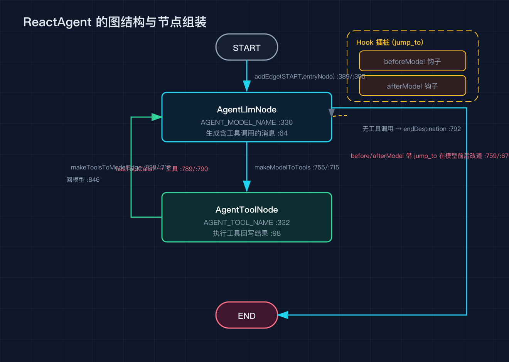
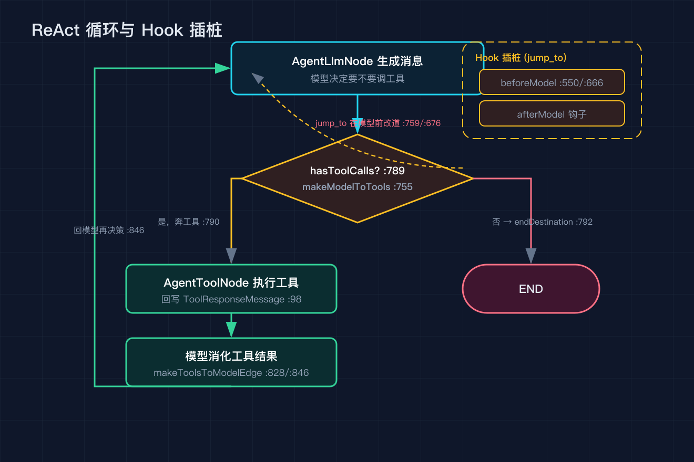

# Spring AI Alibaba 之四：ReactAgent 与 ReAct 循环

基准是 tag v1.1.2.2，提交 7405a7d。本篇所有行号都来自这个提交。

之三把 graph-core 拆完了，那张状态图引擎是通用的。ReactAgent 是 agent-framework 给它的第一种固定拼法：一个模型节点加一个工具节点，靠两条条件边来回跳，就是 ReAct 循环。本篇只看 ReactAgent 怎么用 graph-core 的零件把这件事表达出来。

## 一、initGraph 把图拼出来

ReactAgent 的图在 initGraph 里组装（ReactAgent.java:328 起）。先 new 一个 StateGraph，状态键策略工厂交给 buildMessagesKeyStrategyFactory（:733），所以 messages 这种会生长的键天然走追加。

然后加节点：模型节点 AGENT_MODEL_NAME 包的是 AgentLlmNode（:330，AgentLlmNode.java:64），工具节点 AGENT_TOOL_NAME 包的是 AgentToolNode（:332，AgentToolNode.java:98），但只有 hasTools 为真才加工具节点（:154 判断 toolNode.getToolCallbacks() 非空且非空列表）。没有工具就只有模型节点，自然没有循环。

入口从 START 接到 entryNode（:389/:395），entryNode 由 determineEntryNode 决定，通常是 beforeAgent 钩子或模型节点。

## 二、两条边把 ReAct 串成环

模型到工具的边由 makeModelToTools（:755）路由。它先看 jump_to（钩子能塞这个键强制改道，:759），有就按 model / end / tool 三选一直接走（:771）。没有就退到第二优先级：取 messages 最后一条消息（:779），如果是 AssistantMessage 且 hasToolCalls（:789）就奔 AGENT_TOOL_NAME（:790），否则奔 endDestination（:792）。ToolResponseMessage 分支还会核对请求的工具 id 和实际执行的是否一致，防止状态被改坏。

工具回到模型的边由 makeToolsToModelEdge（:828）路由。它取最后一条 ToolResponseMessage（:831），正常情况直接回到模型节点 loopEntryNode（:846），让模型消化工具结果再决定下一步。注意有个 return_direct 的判定目前是 return false; // FIXME（:836），也就是说官方此刻还没接上工具直通结束这条路，循环只会靠模型不再要工具来退出。

两条边通过 addConditionalEdges 接起来（:715 模型出 / :718 工具回），目的地映射把 AGENT_TOOL_NAME、exitNode、loopEntryNode 都登记上（:715 段 Map.of）。

## 三、Hook 怎么插进循环

钩子不是另开节点，而是借 jump_to 插桩。setupHookEdges（:550）和 addHookEdge（:666）在节点之间加 Hook 节点，钩子执行后把想去的下一跳写进 state.value("jump_to")（:676）。之后 makeModelToTools 第一优先级就会读这个键，于是 beforeModel 钩子能在模型前改道、afterModel 钩子能在模型后改道。这套机制让 AOP 式横切不用污染主循环代码。

## 四、复现模块

code/verify_sources.py 同样在 7405a7d 上把引用的每个行号重新 grep 核对，纯标准库无外部依赖。

## 五、系列排期

之一整体概览（已发）/ 之二 Spring AI 底座（已发）/ 之三 graph-core（已发）/ 之四本篇 ReactAgent 与 ReAct 循环 / 之五内置编排与 A2A / 之六上下文工程与 HITL / 之七可观测 studio admin sandbox / 之八沙箱与工具安全 / 之九实战收尾。

## 六、结尾钩子

之三我把 graph-core 的 nextNodeId 拆开，说状态归约和路由是分开的。本篇的 makeModelToTools 就是路由的一个实例：它不碰状态，只决定去哪。你能想到把 ReAct 拆成这么干净的两段，对你在别的地方写循环有什么启发？尤其是那个 FIXME（return_direct 还没接），如果你要接，会在哪一行加判断？评论区聊聊。
