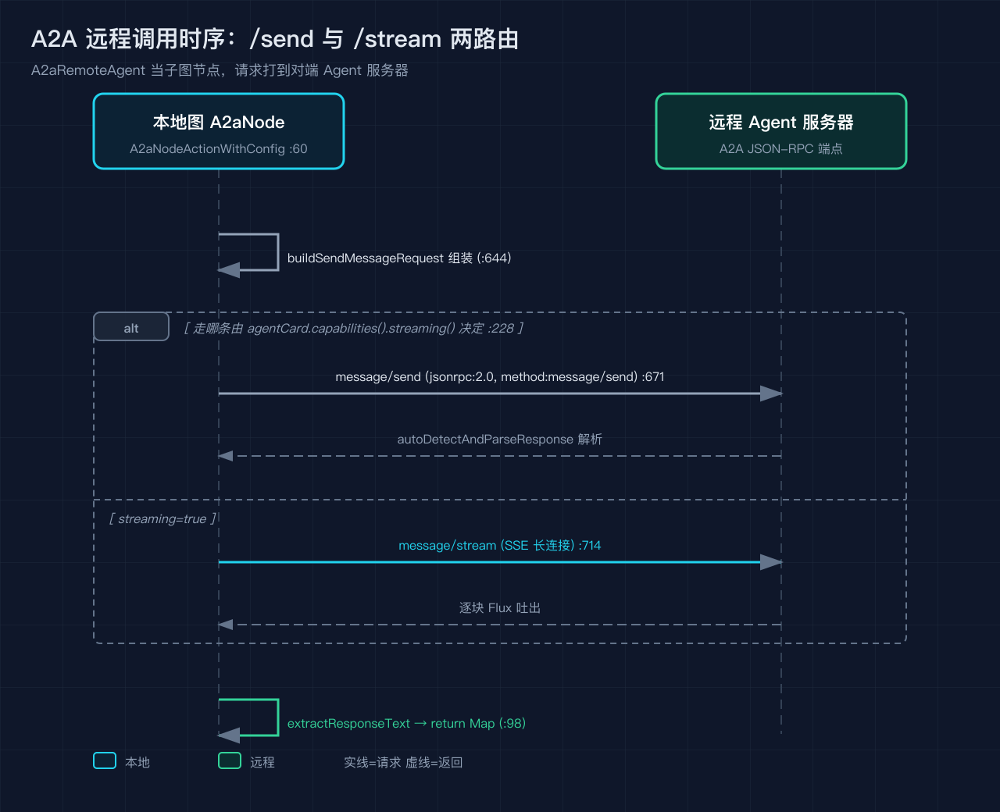
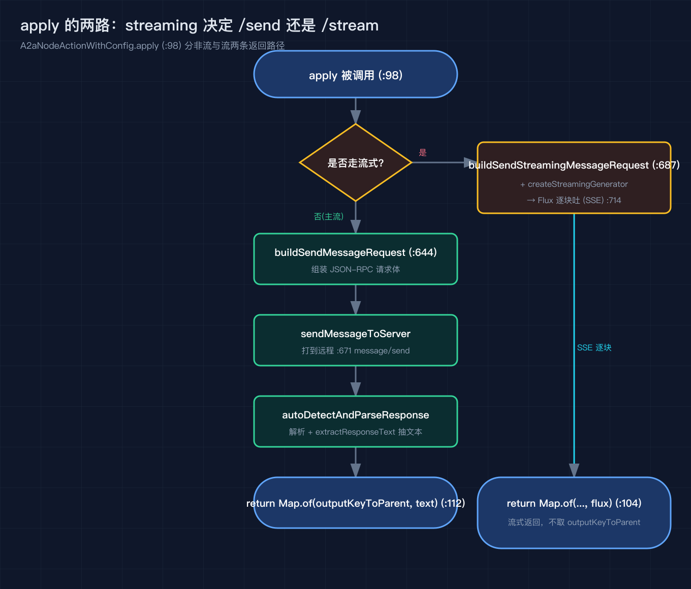
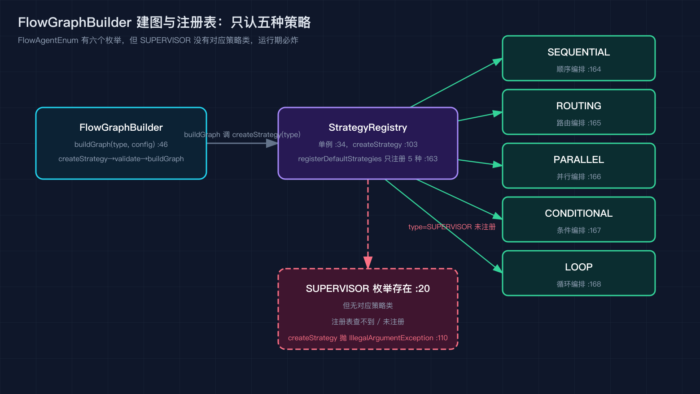
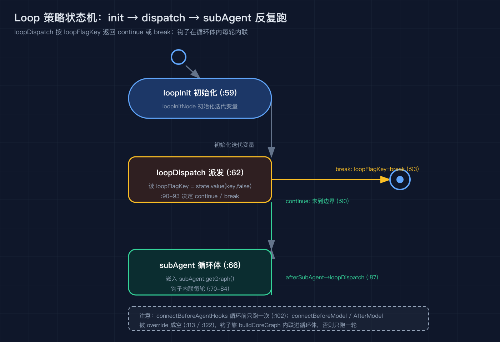

# Spring AI Alibaba 之五：我把五个子智能体拼成客服流水线，才看懂内置 flow 编排和 A2A 远程调用

Spring AI Alibaba 源码级原理拆解之五（系列共九篇），按 tag v1.1.2.2（提交 7405a7d）逐行号核对。

前面四篇我把图引擎和 ReactAgent 拆完了。这一篇讲 agent-framework 里真正拿来搭业务的两种积木：内置 flow 编排，以及 A2A 远程调别人家 Agent。我做客服总机时，把分流、并行查知识、条件复核、循环重试、再远程抛给另一个服务的 Agent，全用这两套拼了起来，过程中把源码读穿了。

先放一张 A2A 远程调用的时序，后面再讲 flow 怎么把本地五个智能体串成图。

## A2A：把一个 Agent 当远程节点用

A2A 的核心想法很朴素：我这边有个图，某个节点不该本地算，要打到另一台机器上跑着的 Agent。框架给的入口是 `A2aRemoteAgent`，它继承 `BaseAgent`（`a2a/A2aRemoteAgent.java:34`）。但它不像 ReactAgent 那样自己建 ReAct 循环，`schedule` 直接抛 `UnsupportedOperationException`（`a2a/A2aRemoteAgent.java:80`），因为它本来就不是给自己跑计划的，只是挂到图里当一个子图节点。

它的 `initGraph`（`a2a/A2aRemoteAgent.java:60`）只做一件事：建一个 StateGraph，加一个名为 A2aNode 的节点，START 连 A2aNode，A2aNode 连 END。A2aNode 的真实动作在 `A2aNodeActionWithConfig`（`a2a/A2aNodeActionWithConfig.java:60`），一个 `NodeActionWithConfig`。

真正发请求的是 `apply`（`a2a/A2aNodeActionWithConfig.java:98`）。它分两路：开了 streaming 就走 `createStreamingGenerator` 拿到 `Flux` 一路吐；没开就 `buildSendMessageRequest` 组装请求，`sendMessageToServer` 发出去，`autoDetectAndParseResponse` 再 `extractResponseText` 抽文本，最后返回 `Map`。

那么走不走流，谁定的？`A2aRemoteAgent.build()` 里有一行很关键：没有显式关 streaming 时，直接读对端 AgentCard 的能力位，`this.streaming = agentCard.capabilities().streaming()`（`a2a/A2aRemoteAgent.java:228`）。也就是说，能不能流，取决于对方声不声明支持流，而不是我本地拍脑袋。

两条 JSON-RPC 方法也对应两套构造。非流式走 `message/send`（`a2a/A2aNodeActionWithConfig.java:671`，`method:"message/send"` 配 `jsonrpc:"2.0"` 在 :670）；流式走 `message/stream`（`a2a/A2aNodeActionWithConfig.java:714`，`method:"message/stream"`）。两者的请求体都在 `buildSendMessageRequest`（:644）和 `buildSendStreamingMessageRequest`（:687）里拼，区别是流式那一份走 SSE 长连接。

## AgentCard：怎么知道对面是谁、在哪

A2A 不是硬编码 URL 调接口，而是靠 AgentCard 这个"名片"。你可以直接给 `agentCard`，构造器会把它包成 `AgentCardWrapper`（`a2a/A2aRemoteAgent.java:174`）；也可以给一个 `agentCardProvider`，让框架自己去拉。拉卡的实现在 `RemoteAgentCardProvider`，它做懒加载，而且支持 extended card，拉扩展信息时会带 `Bearer dummy-token-for-extended-card` 这种占位鉴权头。

这里有个坑我踩过：`shareState` 默认值不一样。`A2aRemoteAgent` 默认 `shareState=true`（`a2a/A2aRemoteAgent.java:141`），意思是把本地的 messages 状态直接喂给远程；但 `A2aNodeActionWithConfig` 的 7 参构造里 `shareState` 默认是 false（:88）。一旦 false，节点会另开一个带 `subgraph_` 前缀的新 threadId（`a2a/A2aNodeActionWithConfig.java:116` 的 `getSubGraphRunnableConfig`），远程那边看到的是一条独立会话，本地上下文根本传不过去。我做总机时一度以为远程 Agent 没拿到历史，其实就是这个默认值撞上了。

## flow 内置编排：五种模式加一个没实现的枚举

讲完远程，讲本地怎么把多个智能体拼起来。框架在 `flow` 包给了一组开箱即用的编排，入口是 `FlowGraphBuilder`（`flow/builder/FlowGraphBuilder.java:37`）。你调 `buildGraph` 时，它先按类型从注册表拿策略（`flow/builder/FlowGraphBuilder.java:47` 的 `createStrategy`），再 `validateConfig`，再 `buildGraph`（:46 到 :49）。配置对象 `FlowGraphConfig`（:55）里收着 rootAgent、subAgents、conditionalAgents 和 hooks（:73 到 :144）。

策略注册表 `FlowGraphBuildingStrategyRegistry`（`flow/strategy/FlowGraphBuildingStrategyRegistry.java:34`）是单例，`getInstance` 在 :49。它真正注册内置策略的地方是 `registerDefaultStrategies`（:163），我数过，一共只注册了五个：`SEQUENTIAL`、`ROUTING`、`PARALLEL`、`CONDITIONAL`、`LOOP`（:164 到 :168）。而枚举 `FlowAgentEnum` 里明明有第六个 `SUPERVISOR`（:20），却没有任何策略类去实现它，注册表里也查不到。`createStrategy` 遇到没注册的 type 会直接抛 `IllegalArgumentException`（:110），`getRegisteredTypes`（:139）也只会列出那五个。所以你写 `SUPERVISOR` 想用监督式编排，运行期必炸。

## 模板方法：钩子是怎么被统一种进图的

五种策略长得不一样，但建图骨架是同一套。抽象基类 `AbstractFlowGraphBuildingStrategy`（`flow/strategy/AbstractFlowGraphBuildingStrategy.java:53`）把 `buildGraph` 写成 final 模板方法（:104）。它先建 StateGraph（:106），再按 `HookPosition` 过滤钩子（:112），把钩子节点加进图（:118），定 entry 和 exit 接 START 边（:124），然后交给各策略实现的 `buildCoreGraph` 填核心结构（:129），最后按位置把四类钩子边接上：`connectBeforeModelHooks`（:134）、`connectAfterModelHooks`（:137）、`connectBeforeAgentHooks`（:140）、`connectAfterAgentHooks`（:143）。钩子过滤和排序在 `filterHooksByPosition`（:255），按 `@HookPositions` 注解筛并按优先级排。

默认情况下这些 connect 方法会按位置把钩子串到 `rootAgent` 上（:184、:202、:219、:239），基类只保证核心智能体先有一个透明节点 `TransparentNode`（:169）。各具体策略要挂钩子，就自己 override 对应的 connect 方法。

## Loop 策略：钩子为什么要内联进循环体

`LoopGraphBuildingStrategy`（`flow/strategy/LoopGraphBuildingStrategy.java:47`）最典型。它的 `buildCoreGraph`（:50）先取出 `loopStrategy`（:52，从 config 的自定义属性 `LoopAgent.LOOP_STRATEGY` 拿）、取出唯一一个 subAgent（:53），然后排三条关键节点：根智能体透明节点（:56）、`loopInitNode`（:59）、`loopDispatchNode`（:62），再嵌入 subAgent 的子图（:66）。循环体里它在 subAgent 前后手动接了 `connectBeforeModelHooks`（:70）和 `connectAfterModelHooks`（:78），循环尾接 `afterSubAgent → loopDispatch`（:87），最后 `loopDispatch` 用条件边按 `loopFlagKey` 返回 continue 或 break（:90 到 :93）。

注意它把 `connectBeforeModelHooks` 和 `connectAfterModelHooks` 直接 override 成空方法（:113、:122）。为什么？因为基类模板方法在 :134、:137 还会再调一次这两个 connect，如果 Loop 不在循环体内自己接、又让基类在外面接一遍，钩子就被接到循环外面、只跑一次，而不是每轮一次。Loop 选择把钩子逻辑内联进 `buildCoreGraph`，再用空实现把基类的那两次调用"短路"掉。`connectBeforeAgentHooks` 则保留一次，在循环前连到根节点（:102）。

循环本身有三种形态，由 `LoopStrategy` 接口加 `LoopMode` 工厂决定：按次数 count、按数组 array、按条件 condition。不管是哪种，迭代靠 `loopInit` 初始化、`loopDispatch` 派发，用 `LOOP_FLAG` 这个键记录是继续还是退出。

## 我踩过的三个坑

第一，A2A 的 `shareState` 默认值和远程节点不一致，本地上下文传不到远程，排查了半天才发现是 `A2aNodeActionWithConfig` 7 参构造里把 `shareState` 默认设成 false（:88），而 agent 层 Builder 默认 true（:141），两层默认值打架。

第二，想用 `SUPERVISOR` 监督式编排，结果注册表里压根没注册（:163 只到 :168），运行期 `createStrategy` 直接抛异常（:110）。枚举里有，不代表能用，这是命名误导。

第三，Loop 的钩子如果不内联、交给基类模板方法在循环外连，每个 subAgent 轮次都不会再过钩子，拦截和计 token 全失效。看懂 `LoopGraphBuildingStrategy` 把 connect 方法 override 成空（:112、:121）才明白这套短路设计。

## 结尾钩子

你有没有遇到过：明明框架文档列了六种 flow 模式，代码一跑却只认五种？这一篇的 `SUPERVISOR` 就是这种"枚举在、实现不在"的坑。下一篇我讲上下文工程与 HITL，会把 `HumanInTheLoopHook` 怎么在 `AFTER_MODEL` 把工具调用挂起等人审、 `SummarizationHook` 怎么在 `BEFORE_MODEL` 压缩上下文、以及 `SubAgentInterceptor` 怎么用 task 工具把子智能体隔离出去，一次性讲透。如果你也在用 SAA 搭多智能体，欢迎在评论区说说你卡在哪个节点，我下一篇挑典型的回。

## 复现模块

- 代码地址：`code/verify_sources.py`（本篇引用的源码行号对照脚本，纯标准库，运行 `python3 code/verify_sources.py` 全绿即说明行号对得上提交 7405a7d）
- 数据源：`alibaba/spring-ai-alibaba`，tag v1.1.2.2，提交 `7405a7dc0d66d582ec79430af6e24d259d5ca6ea`。本地 clone 在 `/tmp/saa`，核对命令：`git checkout 7405a7d`
- 运行命令：`cd /tmp/saa && git checkout 7405a7d`，然后 `python3 code/verify_sources.py`
- 预期输出：脚本末尾打印 `self-test PASS`，通过条数等于 EXPECTED 列表长度，无 FAIL 行
