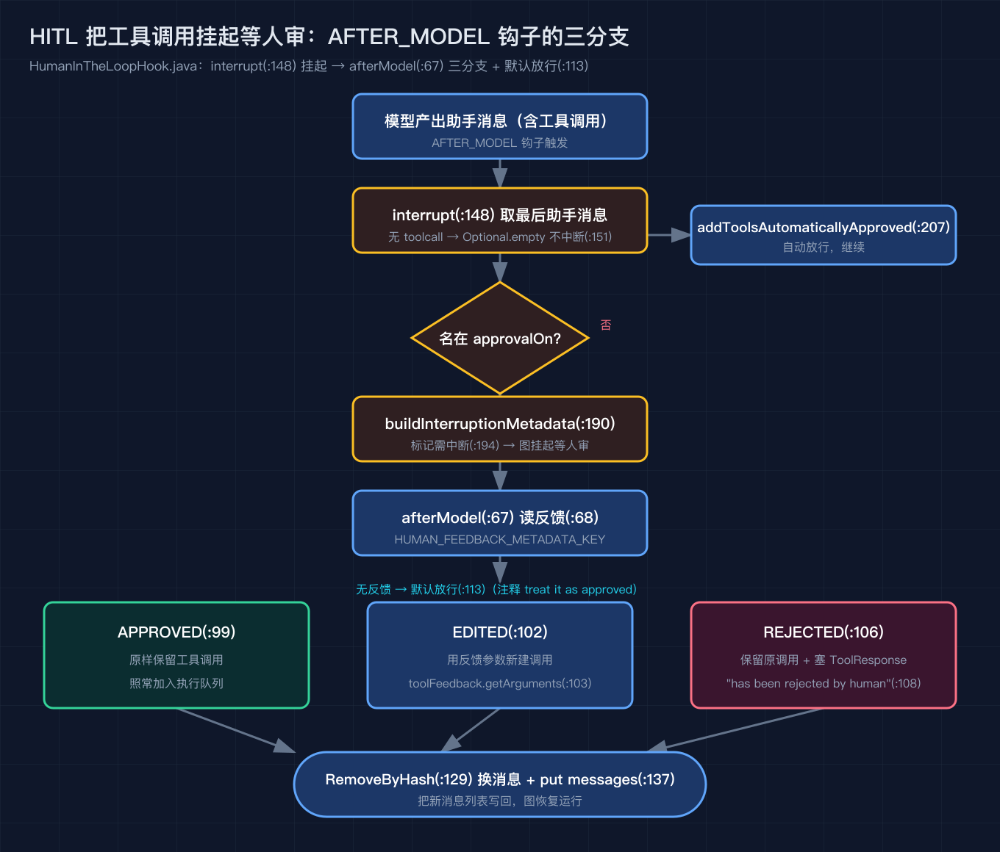
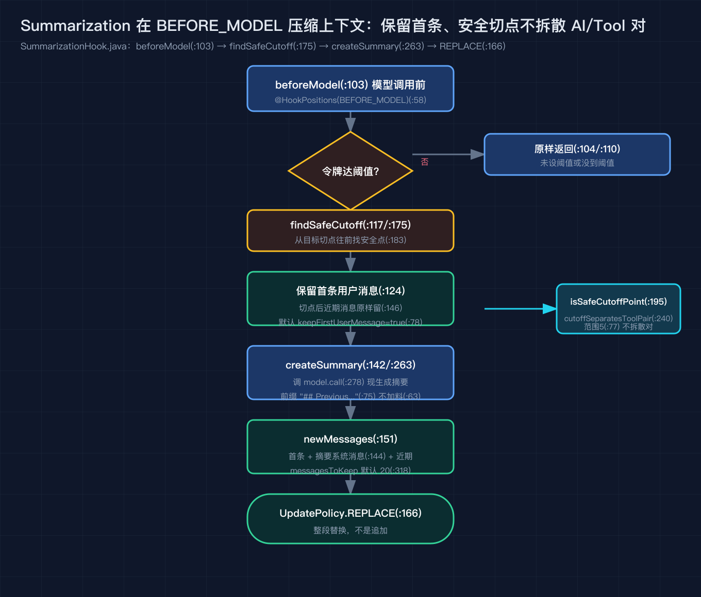
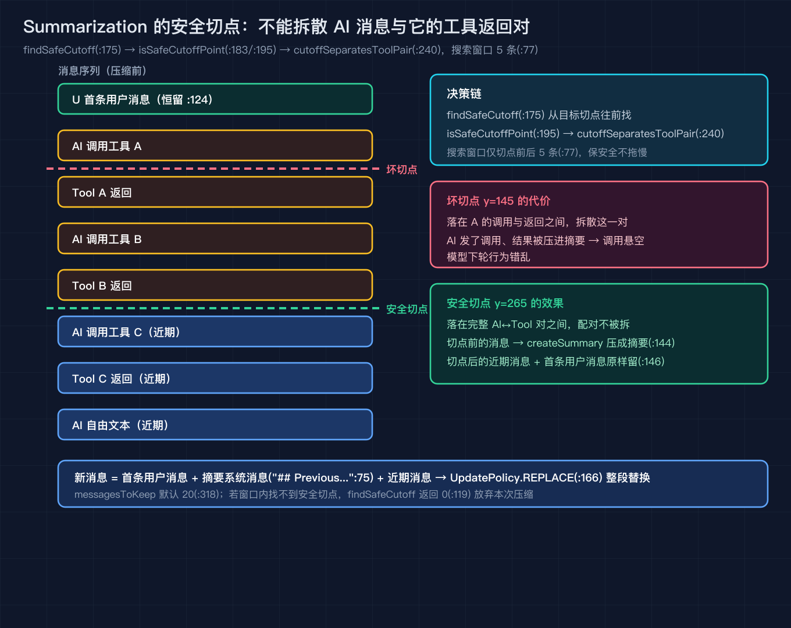
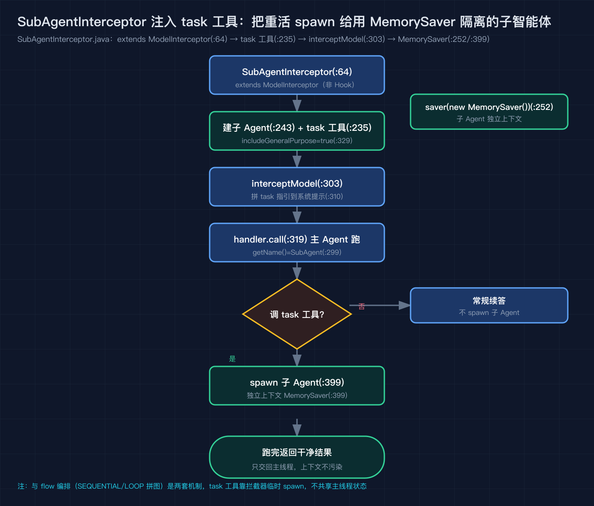

# Spring AI Alibaba 之六：我用 HITL 把危险工具调用挂起等人审，用 Summarization 压住上下文，用 task 工具把子智能体隔离出去

Spring AI Alibaba 源码级原理拆解之六（系列共九篇），按 tag v1.1.2.2（提交 7405a7d）逐行号核对。

前一篇我把内置 flow 编排和 A2A 远程调用拆完，那两条是搭多智能体骨架的。这一篇讲真正贴着业务痛点的三块上下文工程：哪些工具调用必须先等人拍板再执行、上下文长了怎么压缩不丢关键信息、以及把重活扔给子智能体时怎么不让它的上下文污染主线程。我自己的客服 Agent 上线前，这三样是必须调好的，源码读下来发现它们其实分属两个完全不同的扩展点。

先把 HITL 的审批三分支画出来，后面再逐个讲。

## HumanInTheLoop：模型吐出工具调用后，先别急着自己跑

`HumanInTheLoopHook` 长在两个身份上。它既是钩子，注解写的是 `@HookPositions(HookPosition.AFTER_MODEL)`（`hook/hip/HumanInTheLoopHook.java:47`），又是可中断动作，实现了 `InterruptableAction`（`hook/hip/HumanInTheLoopHook.java:48`）。节点名固定叫 `HITL`（`hook/hip/HumanInTheLoopHook.java:50`）。你要审哪些工具，靠 `approvalOn` 这个映射配（`hook/hip/HumanInTheLoopHook.java:51`，构造入口在 `builder.approvalOn`，`hook/hip/HumanInTheLoopHook.java:284` 起）。

它怎么把图挂起？框架在模型产出之后、工具执行之前，会调这个钩子的 `interrupt`（`hook/hip/HumanInTheLoopHook.java:148`）。它先取最后一条助手消息，没有工具调用就直接 `Optional.empty()` 不中断（`hook/hip/HumanInTheLoopHook.java:151`）。有工具调用时，它走 `buildInterruptionMetadata`（`hook/hip/HumanInTheLoopHook.java:190`）：遍历每个工具调用，名字落在 `approvalOn` 里的，拼一条 `ToolFeedback` 并标记需要中断（`hook/hip/HumanInTheLoopHook.java:194`）；名字不在里面的，走 `addToolsAutomaticallyApproved` 自动放行（`hook/hip/HumanInTheLoopHook.java:207`）。只要有一个需要审，`needsInterruption` 为真，返回这份元数据，图就此停顿等人审。

人审完，结果通过 `RunnableConfig.HUMAN_FEEDBACK_METADATA_KEY` 写回（`hook/hip/HumanInTheLoopHook.java:68`）。图恢复时，框架在 `AFTER_MODEL` 位置调 `afterModel`（`hook/hip/HumanInTheLoopHook.java:67`），它读出这份反馈，对每个工具调用按三分支处理：`APPROVED` 原样保留（`hook/hip/HumanInTheLoopHook.java:99`）；`EDITED` 用反馈里的参数新建一条工具调用（`hook/hip/HumanInTheLoopHook.java:102`，参数取自 `toolFeedback.getArguments()`）；`REJECTED` 保留原调用，但额外塞一条 `ToolResponseMessage`，文案写明这个调用被人类拒绝、并附上建议（`hook/hip/HumanInTheLoopHook.java:106`，字符串里含 "has been rejected by human"）。最后用 `RemoveByHash` 把旧的助手消息换掉，把新消息列表写回 `messages`（`hook/hip/HumanInTheLoopHook.java:129`、`:137`）。

有一个细节值得记住：如果某个需要审的工具调用没收到任何反馈，代码注释写得很直白，默认视为通过，照常把它加回执行队列（`hook/hip/HumanInTheLoopHook.java:113`）。所以审批不是"不回就拦下"，而是"不回就放行"，配置时得想清楚这个默认方向。

## Summarization：上下文要到顶了，先压缩再喂给模型

`SummarizationHook` 的注解是 `@HookPositions({HookPosition.BEFORE_MODEL})`（`hook/summarization/SummarizationHook.java:58`），位置刚好和 HITL 错开，它在每次模型调用之前先看看消息总量。它继承 `MessagesModelHook`（`hook/summarization/SummarizationHook.java:59`），返回的是一个 `AgentCommand`。

触发逻辑全在 `beforeModel`（`hook/summarization/SummarizationHook.java:103`）。没设 `maxTokensBeforeSummary` 就原样返回（`hook/summarization/SummarizationHook.java:104`）；用 `tokenCounter.countTokens` 数令牌（`hook/summarization/SummarizationHook.java:108`），没到阈值也原样返回（`hook/summarization/SummarizationHook.java:110`）。一旦超阈值，它调 `findSafeCutoff` 找切割点（`hook/summarization/SummarizationHook.java:117`），然后做三件事：保留首条用户消息（`hook/summarization/SummarizationHook.java:124`，默认 `keepFirstUserMessage=true`），把切点之前的其它消息拿去 `createSummary` 调模型生成摘要（`hook/summarization/SummarizationHook.java:142`），切点之后的近期消息原样留着（`hook/summarization/SummarizationHook.java:146`）。最终新消息列表是首条用户消息加摘要系统消息加近期消息（`hook/summarization/SummarizationHook.java:151`），更新策略是 `UpdatePolicy.REPLACE`（`hook/summarization/SummarizationHook.java:166`），也就是整段替换，不是追加。

这里最讲究的是"安全切点"，看下图。`findSafeCutoff`（:175）先保证消息数大于 `messagesToKeep`（默认 20，:318），再从目标切点往前找，直到 `isSafeCutoffPoint`（:183）判为安全。安全的定义是 `cutoffSeparatesToolPair`（:240）：切点不能把一条 AI 消息和它的工具返回拆到两边，否则这条调用悬空、模型下轮会错乱。搜索窗口限制在切点前后 5 条（:77），既保安全又不拖慢。

摘要本身由 `createSummary` 调 `model.call` 现生成（:263），提示词是一段"只抽取最关键上下文、不要加料"的指令（`DEFAULT_SUMMARY_PROMPT`，:63），前缀固定是 "## Previous conversation summary:"（:75）。

## SubAgent：给主智能体加个 task 工具，把重活扔给隔离出去的子智能体

第三块和前两块出身不同。`SubAgentInterceptor` 不是钩子，它继承 `ModelInterceptor`（`extension/interceptor/SubAgentInterceptor.java:64`），属于拦截器这条扩展线。它的作用是在主智能体的模型调用外面套一层，往系统提示里注入一份 task 工具使用指引（`DEFAULT_SYSTEM_PROMPT`，`extension/interceptor/SubAgentInterceptor.java:68`），并给主智能体挂上一个 `task` 工具（`extension/interceptor/SubAgentInterceptor.java:235`，工具描述里塞了多组使用示例，`TASK_TOOL_DESCRIPTION`，`extension/interceptor/SubAgentInterceptor.java:102`）。

构造时如果开了 `includeGeneralPurpose`（默认 true，`extension/interceptor/SubAgentInterceptor.java:329`），它会顺手建一个通用子智能体，名字叫 `general-purpose`（`extension/interceptor/SubAgentInterceptor.java:231`），这个子智能体用 `ReactAgent.builder().saver(new MemorySaver())` 建（`extension/interceptor/SubAgentInterceptor.java:243`），关键点就在这个 `MemorySaver`：子智能体跑自己的、和主线程不共享的状态。你用 `addSubAgent` 加的自定义子智能体，同样走 `createSubAgentFromSpec`，也配了 `MemorySaver`（`extension/interceptor/SubAgentInterceptor.java:399`）。

真正干活的在 `interceptModel`（`extension/interceptor/SubAgentInterceptor.java:303`）。它把子智能体指引拼到主智能体系统提示末尾（`extension/interceptor/SubAgentInterceptor.java:310`，即 `request.getSystemMessage().getText() + "\n\n" + systemPrompt`），再调 `handler.call(enhancedRequest)`（`extension/interceptor/SubAgentInterceptor.java:319`）。主智能体一旦决定调 `task` 工具，框架就临时起一个子智能体，独立上下文跑完，只把一条干净结果交回主线程。这就把那些多步、重 token、重上下文的活，从主线程里隔离出去了。

要分清：flow 编排是"把多个 Agent 拼成一张图"（前一篇讲的 SEQUENTIAL、LOOP 那一套），`SubAgentInterceptor` 是"在主 Agent 内部塞一个 task 工具、按需 spawn 临时子 Agent"，两者是两套机制，不能混为一谈。HITL 和 Summarization 又另属 `hook` 包，靠 `@HookPositions` 织进图的生命周期。所以这一篇讲的三块，其实是 SAA 里三种不同的上下文控制抓手：钩子管生命周期内的拦截与压缩，拦截器管工具与上下文的隔离。

## 我踩过的三个坑

第一，HITL 的默认方向是"不回就放行"（`hook/hip/HumanInTheLoopHook.java:113`）。我一开始以为没反馈就是挂起，结果危险工具悄悄执行了。需要严格把关的工具，务必在 `approvalOn` 里列全，并且前端审批界面要强制收齐反馈。

第二，Summarization 的切点保护是针对"AI 消息加工具返回"这对的（`hook/summarization/SummarizationHook.java:240`）。如果你的业务里 AI 发工具调用、工具结果跨了很多轮，搜索窗口只有 5（`hook/summarization/SummarizationHook.java:77`），可能找不到安全切点而放弃压缩（`hook/summarization/SummarizationHook.java:119` 返回 0），这时得把 `messagesToKeep` 调大，而不是指望它硬压。

第三，`SubAgentInterceptor` 和 flow 编排是两回事。我最初想用 flow 的 LOOP 把子智能体反复调，却发现子智能体的 `MemorySaver` 是每次 spawn 新建的（`extension/interceptor/SubAgentInterceptor.java:399`），循环里的状态根本不连续；要连续上下文，得回到 flow 这条线去设计，别指望 task 工具帮你记住上一轮。

## 结尾钩子

你有没有遇到过：框架里 HITL 默认"不回就放行"这种反直觉的默认方向？这一篇的 `HumanInTheLoopHook` 就栽在这个默认上。下一篇我讲可观测与沙箱，会把 SAA 怎么把每一步的工具调用、模型输入输出记下来便于排障，以及执行代码类工具时怎么把破坏范围关进沙箱，一次性讲透。如果你也在用 SAA 调上下文工程，欢迎在评论区说说你压上下文时丢过什么关键信息，我下一篇挑典型的回。

## 复现模块

- 代码地址：`code/verify_sources.py`（本篇引用的源码行号对照脚本，纯标准库，运行 `python3 code/verify_sources.py` 全绿即说明行号对得上提交 7405a7d）
- 数据源：`alibaba/spring-ai-alibaba`，tag v1.1.2.2，提交 `7405a7dc0d66d582ec79430af6e24d259d5ca6ea`。本地 clone 在 `/tmp/saa`，核对命令：`git checkout 7405a7d`
- 运行命令：`cd /tmp/saa && git checkout 7405a7d`，然后 `python3 code/verify_sources.py`
- 预期输出：脚本末尾打印 `self-test PASS`，通过条数等于 EXPECTED 列表长度，无 FAIL 行
