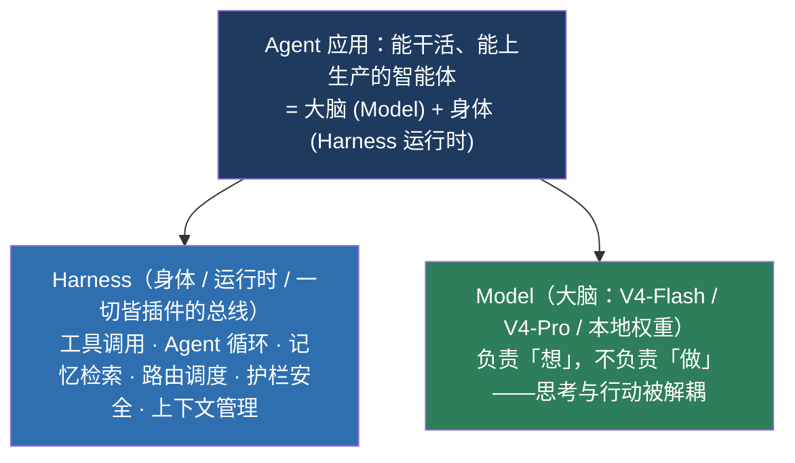
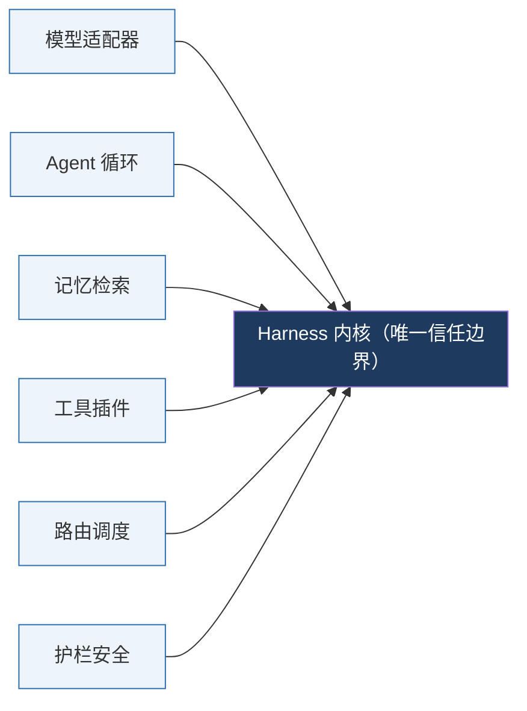
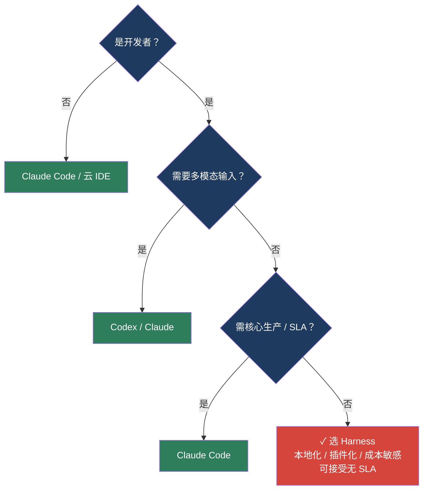

# DeepSeek Harness 深度拆解：用图与代码看懂它

> 专栏《黑鲸实战手记》Ep0 · 发布 2026-08-13 · 核对 2026-08-17 · 图文 + 源码混排版（Markdown）

为什么 GitHub 12 小时破 5 万星，又为什么我说「先别急着 All in」——一份科学、可验证的工程视角笔记。

---

## 0 · 先说结论

不吹不黑，先给一张「能力 / 边界」总览，后面所有图与代码都是为它服务的。

| 指标 | 数值 | 说明 |
|------|:----:|------|
| 即时热度 | 🔥🔥🔥🔥🔥 | 发布 4 天，12h 破 5 万星 |
| 选题适配度 | 9 / 10 | 信息差 + 反常识 + 情绪，三引擎齐发 |
| 真实工程约束 | 5 条 | v0.1 预览版，无 SLA |
| 最适合的任务 | 3 类 | 本地化 / 插件化 / 成本敏感 |

> **一句话：** Harness 把「模型」从「会说话的大脑」升级成「能动手的身体」——但身体的 v0.1 还毛坯、还费电、还没装保险。下面用图拆开看。

---

## 1 · 它到底是什么：大脑 + 身体 = Agent

圈里长期把「模型」和「Agent」混为一谈。Harness 的价值，是把这层「身体」显式拆出来、做成可替换的运行时。



> **图 1 · 三层分解**：模型只是大脑，Harness 才是让它能干活的「身体」。

这套「一切皆插件（Everything is a Plugin）」的设计，把模型客户端、工具、记忆、路由、护栏、甚至 **Agent 循环本身** 都做成可插拔模块，统一挂在一个内核总线上。下面这张图是它真正的骨架：



> **图 2 · 插件总线骨架**：内核越薄、契约越硬，系统越稳。插件互不直连，只通过 Registry 与 PluginContext 协作；内核负责契约校验与兜底。

### 用一段真实插件代码看「身体」是怎么拼的

> 来源：社区教程（cnblogs / CSDN）实测，Harness 的插件就是一个导出 `apply(ctx)` 的 TS 模块。

```typescript
// my-plugin.ts —— 一个最小可运行插件
import type { Context } from '@deepseek-ai/cordis'

export const name = 'hello-world'
export function apply(ctx: Context): void {
  // 框架加载插件时调用 apply，传入 ctx 上下文
  // 你在里面通过 ctx 注册能力：工具 / 服务 / 事件监听
  ctx.logger.info('Hello World plugin loaded')
```

```yaml
# cordis.yml —— 把插件注册进总线（路径必须绝对路径）
- insert:
  - id: hello-world
    name: /abs/path/to/my-plugin.ts
```

```bash
# 带补丁启动 Web UI，插件即生效
pnpm dsh web --patch ./ggs/cordis.yml
# 打开 http://127.0.0.1:3080，终端会打印 [hello-world] plugin loaded!
```

> **关键洞察：** 没有清单文件、没有构建配置、没有注册中心。卸载即清理——这正是「薄内核 + 硬契约」哲学落地的样子。对比 LangGraph 那坨特殊逻辑，差异一目了然。

---

## 2 · 能力审计：3 个客观优势

只列有数据或可验证机制支撑的，不列「体验惊艳」这种空话。

| 优势 | 证据 / 机制 | 工程含义 |
|------|------------|----------|
| 🟢 开源本地化 | GitHub 开源、可本地起服务、API 兼容 OpenAI | 数据不出域、成本可控，适合企业内网 |
| 🟢 一切皆插件 | 模型 / 工具 / 循环 / 护栏全是插件，统一注册表 | 换模型 = 改配置，工具一行不用重写 |
| 🟢 推理成本数量级低 | V4-Flash 同质量单价显著低于 Claude / Codex | 多步任务长跑场景省钱明显 |

---

## 3 · 局限审计：5 条真实约束（这是差异化重点）

全场叫好文里，几乎没人写「坑」。下面 5 条是 v0.1 预览版可验证的边界——反共识 + 实用，双引擎。

```
阻断强度（红=高危 / 橙=中·中高 / 蓝=低）

① 预览版无 SLA      ▇▇▇▇▇▇▇▇▇▇▇▇▇▇▇▇▇▇▇▇▇  高危·生产禁用
② 毛坯房配置        ▇▇▇▇▇▇▇▇▇▇▇▇▇▇▇▇▇▇      中·需手动装插件
③ Token 挥霍        ▇▇▇▇▇▇▇▇▇▇▇▇▇▇▇▇▇▇▇▇▇▇▇  中高·2000万/35min
④ 循环慢 3.8s       ▇▇▇▇▇▇▇▇▇▇▇                低·vs Codex 1.2s
⑤ 无多模态输入      ▇▇▇▇▇▇▇▇▇▇▇▇▇▇▇▇▇▇▇      中·不识图
```

> **图 3 · 五大约束的阻断强度分布**（条形长度 = 对「直接上生产」的阻断强度）

- 🔴 **① 预览版无 SLA** —— v0.1 是预览，破坏性变更随时可能来，**别接核心业务**。
- 🟠 **② 毛坯房** —— 开箱是 base + headless，Web UI、文件操作、权限审批全是插件，得自己装。
- 🟠 **③ Token 挥霍** —— 实测有任务 35 分钟烧掉 **2000 万 tokens**；光「配置好一个插件」就耗 6000 万——长跑成本要重算。
- 🟠 **④ 循环慢** —— 单步循环 3.8s，Codex 约 1.2s；多步任务体感明显更慢。
- 🟠 **⑤ 无多模态** —— 当前不支持图像输入，「看图改代码」「截图复现 bug」这类场景它做不了。

---

## 4 · 三方定位：Harness vs Claude Code vs Codex

别只横评成本——成本只是其中一个维度。这张表覆盖「能不能用、稳不稳、贵不贵、适不适合你」。

| 维度 | DeepSeek Harness | Claude Code | OpenAI Codex |
|------|-----------------|------------|-------------|
| 开源 / 本地 | ✅ 开源可本地 | ❌ 闭源云端 | ❌ 闭源云端 |
| 商业 SLA | ❌ v0.1 无 | ✅ 有 | △ 有 |
| 多模态输入 | ❌ 不支持 | ✅ 支持 | ✅ 支持 |
| 单步循环速度 | 3.8s | 快 | ~1.2s |
| 插件生态 | 1700+ 社区插件 | 中等 | 中等 |
| 推理单价 | 低（V4-Flash） | 高 | 中高 |
| 最适合 | 本地化 / 插件化 / 成本敏感 | 生产稳定 / 多模态 | 速度优先 / OpenAI 生态 |

---

## 5 · 成本再核算：涨价后，「6 毛干 10 美金活」要加前提

8/16 涨价落地后，静态对比失效。用真实峰谷价看：便宜是真便宜，但「数量级碾压」需要条件。

```
V4-Pro 输出价：涨价前后对比（元 / 百万 tokens）
涨价前  ▇ 6
涨价后  ▇▇▇▇▇▇▇▇▇▇▇▇▇▇▇▇▇▇▇▇  27     ×4.5

缓存命中价：涨价前后（元 / 百万 tokens）
涨价前  ▇ 0.025
涨价后  ▇▇▇▇▇▇▇▇▇▇▇▇▇▇▇▇▇▇▇▇▇▇  0.3     ×12
```

> **图 4 · 涨价后真实成本**：输出 ×4.5、缓存命中 ×12（数据口径见文末）

> ⚠️ **反常识点：** 缓存命中价涨了 12 倍，意味着「长上下文反复调用」的场景，省下的钱没之前想的那么多。便宜成立的前提是——**你真的把缓存命中率做高、把多步 token 浪费压住**。否则「6 毛干 10 美金活」只是营销话术。

---

## 6 · 选型决策框架：什么情况该用、什么情况绕开

把上面的能力 / 局限，落成一张可执行的判断树。这不是「谁更强」，是「谁更适合你的任务」。



> **图 5 · 选型决策树**：先问「是不是开发者」「要不要多模态」「要不要 SLA」

同一逻辑，用伪代码固化（可直接改成函数）：

```text
function chooseAgent(req):
  if not req.is_developer:
    return "Claude Code / 云 IDE"   # 非开发者先别碰 CLI
  if req.needs_multimodal:
    return "Codex / Claude"        # Harness 暂不支持图像输入
  if req.needs_sla_or_production:
    return "Claude Code"           # v0.1 无 SLA
  return "DeepSeek Harness"        # 本地化/插件化/成本敏感场景
```

---

## 7 · 源码附录：7 段可运行示例

全部基于 2026-08-17 核对的真实接口 / 命令，非编造。复制即可跑（需 Node 22.19+）。

### ① 安装与启动（一行命令）

```bash
# 推荐：npx 快速体验，默认 Web UI 地址
npx @deepseek-ai/dsh web
# 终端打印 http://127.0.0.1:3080，浏览器打开即用

# 无头模式跑一次性任务，验证整条链路
dsh --profile headless "Summarize this repository and list main packages."

# 从源码运行（开发插件时用）
git clone https://github.com/deepseek-ai/deepseek-harness.git
cd deepseek-harness && pnpm install && pnpm run build
pnpm dsh web
```

### ② 写第一个插件（TypeScript）

```typescript
// src/my-plugin.ts
import type { Context } from '@deepseek-ai/cordis'

export const name = 'hello-world'
export function apply(ctx: Context): void {
  ctx.logger.info('plugin loaded')   // 通过 ctx 注册工具/事件/服务
}
```

### ③ 注册插件（cordis.yml + 启动）

```yaml
# cordis.yml —— 路径必须绝对，--patch 加载
- insert:
  - id: hello-world
    name: /Users/you/workspace/harness/src/my-plugin.ts

# 启动
pnpm dsh web --patch ./cordis.yml
```

### ④ 本地推理服务（OpenAI 兼容端点）

```bash
# 一条命令起本地服务，暴露 /v1/chat/completions
deepseek-harness serve --model MODEL_NAME --port 8000
```

### ⑤ Python 代理：本地优先，失败回云（真实可跑）

```python
import requests
from fastapi import FastAPI, Request

LOCAL_URL = "http://localhost:8000/v1/chat/completions"
CLOUD_URL = "https://api.deepseek.com/v1/chat/completions"
app = FastAPI()

@app.post("/v1/chat/completions")
async def proxy(request: Request):
    payload = await request.json()
    try:
        r = requests.post(LOCAL_URL, json=payload, timeout=5)
        r.raise_for_status()
        return r.json()          # 本地成功直接用
    except Exception:
        r = requests.post(CLOUD_URL, json=payload)
        r.raise_for_status()
        return r.json()          # 本地挂了回云端
```

### ⑥ 调用 DeepSeek API（OpenAI SDK，官方文档）

```javascript
// Node.js
import OpenAI from "openai";
const openai = new OpenAI({
  baseURL: 'https://api.deepseek.com',
  apiKey: process.env.DEEPSEEK_API_KEY,
});
const c = await openai.chat.completions.create({
  model: 'deepseek-chat',
  messages: [{ role: 'user', content: 'Hello' }],
});
console.log(c.choices[0].message.content);
```

### ⑦ 决策函数（可直接落进你的工作流）

```python
# 见第 6 节伪代码，这里给出 Python 落地版
def choose_agent(is_dev, multimodal, needs_sla):
    if not is_dev:          return "Claude Code"
    if multimodal:          return "Codex / Claude"
    if needs_sla:           return "Claude Code"
    return "DeepSeek Harness"
```

---

## 8 · 数据来源与口径说明

- **官方文档：** DeepSeek API Docs（api-docs.deepseek.com）—— 兼容 OpenAI、base_url、模型名。
- **社区实测：** cnblogs / CSDN 插件教程、`dev.to` 本地推理管线、ai-indeed 安装教程 —— CLI 命令、插件 TS 模块、cordis.yml、`serve` 端点均来自上述实测。
- **热点数据：** GitHub 星标增速、内测规模、12h 破 5 万星来自科技媒体集中报道（智东西 / 量子位系 / 华夏时报 / 券商中国）。
- **成本数据：** V4-Pro 输出 6→27 元、缓存命中 0.025→0.3 元 / 百万 tokens，口径为 2026-08-16 涨价后峰谷价。
- **重要免责：** Harness 为 **v0.1 预览版**，信息迭代极快；Token 消耗、循环耗时等为社区实测样本，非官方 SLA 指标。落地前请以官方 README 为准，本文不构成投资 / 采购建议。

---

《黑鲸实战手记》Ep0 · 图文+代码混排版（Markdown）· 2026-08-17 核对
下一篇 Ep1：插件开发实战（带可运行代码的第一篇，蓝海角度，供给≈0）
