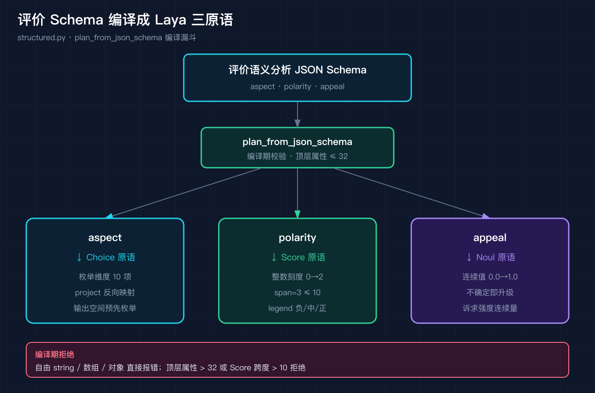
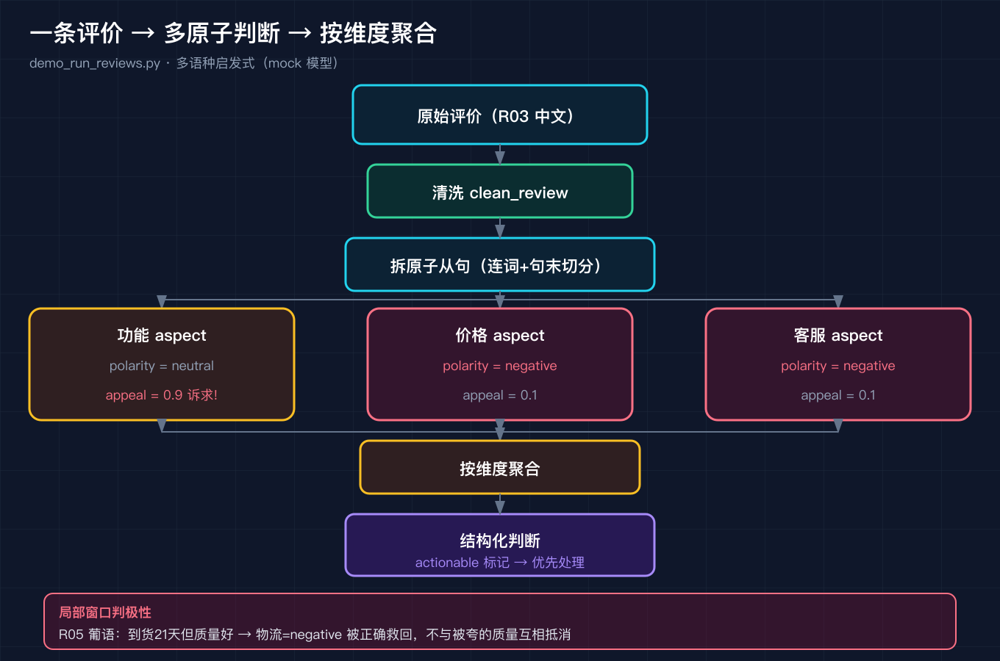

# 用 Laya 把出海 App 的几百条混语评价拆成可统计的判断

我接过一支出海 App 团队的活。他们后台每天堆着几百条用户评价，语言杂得很，中文、英文、葡萄牙语、西班牙语混在一起。运营同学最头疼的不是看不懂，而是看不过来。他们真正想做的只有两件事：第一，判断每条评价的感情倾向，是夸还是骂；第二，把里面带着诉求的评价挑出来，比如"希望你们修复导出功能，否则我不再续费"，优先排给产品去处理。

这件事看似简单，真要做成自动化的判断系统，坑比想象多。我没直接上手写一堆 if else，而是把 Laya 的 typed-decisions 三原语搬过来，给"用户评价语义识别"重新建一次模。这篇不拆 Laya 的源码，就带你把这条流水线实打实跑通一遍：怎么准备数据、怎么定义 Schema、怎么清洗、怎么把一条评价拆成多个可统计的判断，以及我踩过的四个坑。

为什么不直接把评价丢给大模型让它写一段总结？因为总结是给人看的，没法统计。运营要的是今天多少条在骂物流、哪些人喊着要不再续费，这些得是可聚合的结构。Laya 的三原语恰好回答这个问题：它不生产自由文本，它只生产确定性判断。把评价建模成三原语，等于把看评论这件模糊的事，变成给每条评价打三个确定字段这件可以批量、可以统计、可以接告警的事。

## 操作步骤

### 第一步：准备脱敏数据集

真实生产里，原始评价当然要留底，但判断系统吃的是结构化输入。我准备了一份 `code/reviews.json`，里面是 10 条脱敏评价，覆盖中、英、葡、西四语。这些样本不是真实用户原话，是从应用商店公开评论区和跨境电商公开评价区反复出现的语言模式里合成的去标识化数据，姓名、订单号、具体日期、店铺和品牌名全部泛化，不指向任何真实个人。

这么做有两个好处。一个是守住隐私底线，另一个是让 demo 可复现：你拿到的 reviews.json 和我跑出来的结果，和读者拿到的一字不差。这一步你实际要做的，就是把你自己的评价按同样的 JSON 形状填进去，每条留一个 id 和原始文本即可。

### 第二步：定义 Schema，把三个判断映射到三原语

Laya 的三原语是 Choice（枚举）、Score（整数刻度）、Noul（连续值）。我把评价拆成三个字段：评价的维度（物流、客服、价格、稳定性、界面、质量、包装、学习、功能、其他）是预先枚举的集合，对应 Choice；评价的极性（负向、中性、正向）对应 Score，用整数刻度 0 到 2，跨度不超过 10；评价里有没有可落地的诉求，对应 Noul，输出一个 0 到 1 之间的连续值，越接近 1 越说明用户带着明确诉求。

把三个字段写成一份 JSON Schema，交给 Laya 的编译漏斗 `plan_from_json_schema`，就得到下面这份编译结果。



```
评价语义分析 Schema 编译结果（三原语）：
{
  "aspect": {
    "name": "aspect",
    "primitive": "choice",
    "options": ["物流", "客服", "价格", "稳定性", "界面", "质量", "包装", "学习", "功能", "其他"]
  },
  "polarity": {
    "name": "polarity",
    "primitive": "score", "minimum": 0, "maximum": 2, "span": 3,
    "legend": {"0": "negative", "1": "neutral", "2": "positive"}
  },
  "appeal": {
    "name": "appeal",
    "primitive": "noul", "minimum": 0.0, "maximum": 1.0
  }
}
```

`aspect` 编译成 choice，因为维度是枚举；`polarity` 编译成 score，因为极性落在整数刻度；`appeal` 编译成 noul，因为它是连续量。这套映射和 Laya 源码 `structured.py` 里的 `_enum_field`、`_score_field`、`_field` 分派完全对应。你定义 Schema 时只要写清每个字段的类型，编译漏斗会自动把它们落到正确的原语上。

### 第三步：四道闸清洗，判断之前先去掉噪声

一条真实评价进来判断之前，得先过清洗。Laya 在 `email.py` 里有一套 `clean_review` 的四道闸，我直接复用。第一道归一化空白，把各种奇怪的换行和全角空格压平。第二道剥离噪声行，比如系统自动生成的"默认好评""已确认购买"这类空话。第三道压缩 emoji 刷屏，连续一堆表情压成一个。第四道超长截断，头 80 字加尾 40 字拼接，中间丢弃。


举一个具体的例子。一条原始评价可能是这个样子：默认好评。物流挺快😀😀😀 包装   扎实，反正还行。过完四道闸，它会变成：物流挺快 包装扎实 反正还行。开头的默认好评这句空话被剥掉，三个表情压成一个，多余空白被压平。这一步你只要调用 `demo_clean_review.py`，原始文本进、清洗文本出，不用自己写正则。

### 第四步：拆原子判断并按维度聚合

这是最关键的一步。一条评价往往同时说到好几个方面。R03 既骂了会员更差，又骂了客服态度，还带了一句功能诉求。如果整条评价共享一个极性，就会把"会员差"和"希望修导出"搅成一团，既看不出哪个维度出问题，也挑不出哪句带诉求。

我的做法是先按连词和句末标点把一条评价拆成多条原子从句，再让每个从句命中它涉及的维度，最后按维度聚合：同一个维度取多数极性，取最大诉求度。聚合之后 R03 就拆成了功能（中性、诉求度 0.9、标为 actionable）、价格（负向）、客服（负向）三条独立判断。



直接跑 `demo_run_reviews.py`，全量 10 条评价会一次性产出结构化判断。下面节选自实跑 stdout，可见每条评价被拆成按维度排列的原子判断：

```
[R02] lang=zh  清洗后(1从句): 物流真的快，从下单到收货只用了四天，包装也很扎实，客服回复也及时，总之很满意，会回购。…
    - 包装   polarity=positive appeal=0.1
    - 客服   polarity=positive appeal=0.1
    - 物流   polarity=positive appeal=0.1

[R03] lang=zh  清洗后(3从句): 买了会员之后体验反而更差了。客服态度超差，反馈的问题基本得不到解决，笔记导出还是乱序。希望你们尽快修复导出功能，否则我只…
    - 功能   polarity=neutral  appeal=0.9 [诉求!]
    - 价格   polarity=negative appeal=0.1
    - 客服   polarity=negative appeal=0.1

[R04] lang=zh  清洗后(1从句): 界面挺好看的，用着也顺手，就是偶尔会卡顿，希望后续优化一下性能。…
    - 界面   polarity=positive appeal=0.5
    - 稳定性  polarity=neutral  appeal=0.5

[R05] lang=pt  清洗后(2从句): A entrega demorou vinte e um dias, mas a qualidade do produt…
    - 其他   polarity=neutral  appeal=0.1
    - 物流   polarity=negative appeal=0.1
    - 质量   polarity=neutral  appeal=0.1

[R08] lang=zh  清洗后(1从句): 整体还行，但每个笔记只能插图二十张，对我这种图片为主的用户限制太大，建议提高上限。…
    - 功能   polarity=neutral  appeal=0.9 [诉求!]

[R10] lang=zh  清洗后(2从句): 用了三个月，帮我省了不少钱，物流也比想象中快。就是希望增加本地仓发货的选项，这样退换货更方便。…
    - 物流   polarity=positive appeal=0.9 [诉求!]
    - 价格   polarity=positive appeal=0.1
```

R02 是纯好评，三个维度全正向、无诉求；R03 同时命中价格负向、客服负向，外加一条被标为诉求的功能判断；R04 夸了界面，又提了一句性能卡顿，稳定性被标成中性但诉求度 0.5；R05 的物流负向已经被局部窗口正确救回；R08 纯建议但足够具体，功能维度诉求度 0.9 排进 backlog；R10 夸完省钱和物流快，尾巴带了一句"希望增加本地仓"，物流维度诉求度 0.9 被挑出来。

## 实践指南：我踩过的四个坑

### 坑一：自由文本在编译期就被拒，不是跑起来才报错

我第一次写 Schema 的时候，顺手加了一个 `comment` 字段，类型写 `string`，想着"把用户原话也存下来"。结果编译漏斗直接抛错：`comment: free string is rejected at compile time`。

这不是 Laya 不够灵活，而是一个刻意的纪律。Laya 要求每一个输出字段都有确定的输出空间，要么是枚举，要么是有限刻度，要么是连续区间。自由文本没有输出空间，一旦放进 Schema，下游就没法做确定性判断，也没法把多条评价聚合成可统计的结构。真实生产里，原始评价当然要留底，但那该存在数据层，不该混进"判断契约"里。判断契约只管"维度、极性、诉求度"这三件确定性的事。所以第一步准备数据时，把原话留在 reviews.json 的原文里，Schema 里只放三原语字段。

### 坑二：剥离噪声时，绝不能误删真实诉求

第二道闸最危险。我一开始用裸词匹配，看见"默认"就删，结果一条真实评价"默认设置下导出还是乱序"被整句删掉了，因为里面恰好有"默认"二字。这条评价恰恰是 R03 里带着功能诉求的那句，删了就等于把用户的投诉当垃圾扔了。

修复方法是把噪声匹配绑定名词，而不是裸词。Laya 源码里也是这个纪律，剥离"已购确认"这类免责页脚时，正则绑的是完整的名词短语，而不是单个字。比如只删"系统默认好评"这种固定四字词，绝不碰"默认设置下"这种正常句子。这个纪律看着小，一旦漏掉一句带着不再续费威胁的评价，业务损失是实打实的。

### 坑三：极性要按局部窗口判，否则好质量和慢物流会互相抵消

拆从句之后还有个坑。我最初在整条从句上判极性，结果 R05 葡萄牙语说"到货花了二十一天，但产品质量很好"，从句同时命中了物流和质量，全局极性被"质量好"拉成正向，物流那句"二十一天"反而被判成 positive。一条明显在抱怨物流慢的评价，模型说它物流满意，荒唐。

修复方法是把极性判定限制在命中关键词的局部窗口内。比如物流维度的关键词是"entrega"（葡语送达），我就只在这个词前后十五个字符的窗口里数否定词和肯定词，窗口外"质量好"不进来。改完之后 R05 的物流正确判成 negative，质量判成 neutral。这个坑的本质是：复合判断必须拆到原子粒度，再用代码组合，不能拿全局统计糊弄。

### 坑四：关键词启发式只是 mock，真实 Laya 用 checkpoint 扛多语种

我得说清楚，上面这套"模型"是确定性关键词启发式，是为了可复现而写的演示替身，不是 Laya 真实的生产模型。它的天花板很明显：R01 用英文写"subscription is worth it"（订阅值这个价），我的启发式把它判成价格中性，但人眼看这是句夸奖。原因很简单，关键词匹配不懂语义，只懂字面。R06 是西班牙语，说镜子到货时有一盏灯不亮，写信给客服，对方让他直接丢掉旧镜子，他不知道车库里那面破镜子该怎么办。我的启发式把质量判成负向，客服判成中性，因为客服那句字面是告知，没有肯定词也没有否定词命中。这是个 mock 的盲区：人能读出客服让他自己处理破镜子其实也是一种推诿，但关键词层读不出来。

真实环境里，第二到第四步由 Laya 的 typed-decisions 多语种 checkpoint 承担，再经 `router.py` 路由到对应语种的检查点，根本不需要手写葡语西语的规则。我这个 mock 存在的意义，是把 Laya 的"建模形状"和"清洗纪律"讲清楚，而不是声称它能替代真模型。看到 mock 的局限，反而更说明为什么要把判断交给专门的 checkpoint，把路由交给 Laya。

## 总结 Laya 的作用

跑完这条流水线，回过头看 Laya 到底帮了什么忙，我归结成三点。

第一，它把"判断"在数学上拆成三种确定形状。Choice、Score、Noul 不是三个随意的 API 功能，而是把"判断"预先枚举好的输出空间。你的契约一旦写清每个字段的类型，编译漏斗就把它们落成可枚举、可刻度、可连续的确定性结构，后面聚类和统计才有抓手。

第二，它把纪律做进了编译期。自由文本被拒、刻度跨度超 10 被拒、顶层属性超 32 被拒，这些都不是运行报错，而是你在写契约时就被拦下来。这种前置约束逼着你在动手前先想清楚要建模什么，而不是想到什么塞什么。

第三，它把"判断"和"路由"两件事彻底分开。判断交给 typed-decisions 的多语种 checkpoint，路由交给 router 按照语种和字段派发到对的检查点。评价系统只管产出确定性判断，语种和派发交给 Laya，你不用在业务代码里写一堆 if 语言。

所以回到开头那个场景：你不用再每天凭感觉翻几百条混语评价。把评价建模成三原语，先挑出被标了诉求的那几条去改，比凭感觉翻评论要有用得多，而且这些判断可以直接接告警、接周报、接产品 backlog。

## 结尾钩子

你后台那几百条评价，现在是不是还堆着没人看？把这套三原语建模跑起来，先挑出被标了诉求的那几条去改，比每天凭感觉翻评论要有用得多。

但还有一个问题值得想想：当一条评价同时命中价格、客服、稳定性三个维度，而且三个都负向，你该先动哪一个？拆得越细，排优先级越有据可依，而这正是 Laya 把复合判断拆成原子、再用代码组合的要义。如果你在自己的数据集上跑出了不一样的坑，或者想看多语种评价怎么路由到对的 checkpoint，欢迎在评论区发你的样本，我下一期可以接着讲路由那一层。
